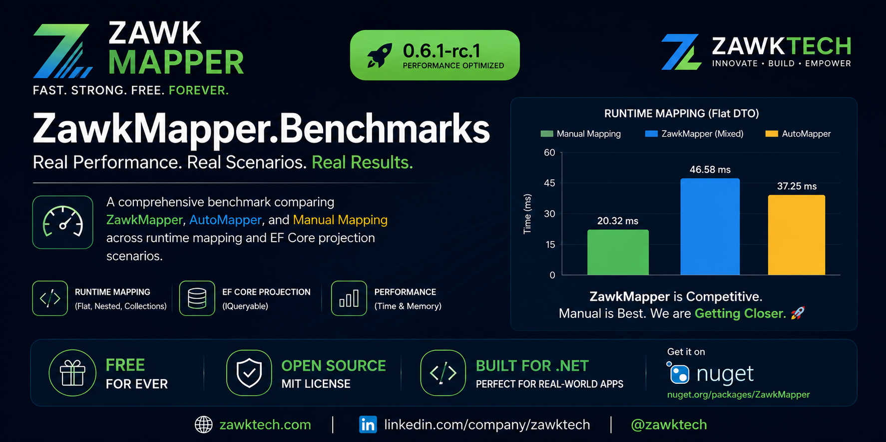

<p align="center">
  
</p>

<p align="center">
  
</p>

# ZawkMapper.Benchmarks



**ZawkMapper.Benchmarks** is a public benchmark project comparing **ZawkMapper**, **AutoMapper**, and **Manual Mapping** across real .NET mapping scenarios.

This repository focuses on practical performance testing for:

- .NET object mapping
- C# DTO mapping
- AutoMapper alternative comparison
- runtime object mapping
- nested object mapping
- collection mapping
- EF Core IQueryable projection
- `ProjectAs` vs `ProjectTo` vs manual `Select`
- time, memory, per-record cost, and checksum validation

ZawkMapper is developed by **ZawkTech** as a free .NET object mapper with simple APIs, honest benchmarks, and continuous performance improvement.

---

## Quick links

- NuGet package: https://www.nuget.org/packages/ZawkMapper/
- ZawkTech website: https://www.zawktech.com
- ZawkTech LinkedIn: https://www.linkedin.com/company/zawktech
- Developer LinkedIn: https://www.linkedin.com/in/zameer-vighio/
- Main ZawkMapper repo: https://github.com/zameer-hussain/ZawkMapper
- Benchmark repo: https://github.com/zameer-hussain/ZawkMapper.Benchmarks

---

## Latest tested package

```xml
<PackageReference Include="ZawkMapper" Version="0.6.1-rc.1" />
```

The benchmark below was run using the published NuGet package, not a local DLL reference.

---

## Benchmark environment

Benchmark results depend on CPU, RAM, storage speed, .NET SDK/runtime version, operating system, database provider, and background workload. These numbers should be read as one transparent test environment, not a universal guarantee.

| Item | Value |
|---|---|
| Device | HP Pavilion Laptop 15t-eg000 |
| Operating system | Windows 11 Pro |
| Windows version | 25H2 |
| OS build | 26200.8457 |
| Processor | 11th Gen Intel(R) Core(TM) i7-1165G7 @ 2.80GHz |
| RAM | 16.0 GB, 15.8 GB usable |
| System type | 64-bit operating system, x64-based processor |
| Graphics | Intel(R) Iris(R) Xe Graphics |
| Storage | 954 GB |
| Database | SQLite local file |
| Build mode | Release |
| Runtime data size | 100,000 customers and 50,000 orders |

---

## How to run

From the benchmark repository root:

```bash
dotnet restore
dotnet build -c Release
dotnet run --project ./src/ZawkMapper.Benchmarks/ZawkMapper.Benchmarks.csproj -- compare --take 100000
```

The benchmark generates console output and report files under the `results` folder.

---

## What is compared

### Runtime mapping

Runtime mapping compares in-memory object mapping:

- Manual Mapping
- AutoMapper
- ZawkMapper `MapField`
- ZawkMapper `MapFieldDirect`
- ZawkMapper `MapFieldStrict`
- ZawkMapper Mixed configuration

### EF Core projection

Projection compares queryable database projection:

- Manual `Select`
- AutoMapper `ProjectTo`
- ZawkMapper `ProjectAs`

### ZawkMapper runtime variants

| Variant | Meaning |
|---|---|
| `MapField` | Flexible mapping, useful for conversions, computed values, nested objects, and collection bridges |
| `MapFieldDirect` | Direct assignment where valid |
| `MapFieldStrict` | Strict same-type member mapping where valid |
| `Mixed` | Practical real-world style using direct/simple mappings plus flexible mappings for computed or nested cases |

---

## Result summary

### Runtime flat customer DTO

| Mapper | Time | Memory | Per record | Bytes/record |
|---|---:|---:|---:|---:|
| Manual Mapping | 20.320 ms | 11.37 MB | 0.203 µs | 119.20 B |
| AutoMapper | 37.250 ms | 16.19 MB | 0.372 µs | 169.76 B |
| ZawkMapper MapFieldStrict | 40.501 ms | 14.91 MB | 0.405 µs | 156.34 B |
| ZawkMapper MapField | 43.808 ms | 14.92 MB | 0.438 µs | 156.42 B |
| ZawkMapper Mixed | 46.576 ms | 14.91 MB | 0.466 µs | 156.34 B |
| ZawkMapper MapFieldDirect | 52.584 ms | 14.91 MB | 0.526 µs | 156.34 B |

**Observation:** Manual mapping is fastest. ZawkMapper uses less memory than AutoMapper in this flat runtime scenario, while runtime speed remains close enough for practical evaluation.

---

### Runtime order summary DTO

| Mapper | Time | Memory | Per record | Bytes/record |
|---|---:|---:|---:|---:|
| Manual Mapping | 26.822 ms | 7.59 MB | 0.536 µs | 159.22 B |
| ZawkMapper MapFieldStrict | 48.853 ms | 12.43 MB | 0.977 µs | 260.71 B |
| ZawkMapper Mixed | 51.815 ms | 12.43 MB | 1.036 µs | 260.71 B |
| ZawkMapper MapFieldDirect | 54.326 ms | 12.43 MB | 1.087 µs | 260.71 B |
| AutoMapper | 61.011 ms | 13.10 MB | 1.220 µs | 274.80 B |
| ZawkMapper MapField | 70.769 ms | 12.43 MB | 1.415 µs | 260.78 B |

**Observation:** ZawkMapper is faster than AutoMapper in this runtime summary DTO scenario and also allocates slightly less memory.

---

### Runtime nested order detail DTO

| Mapper | Time | Memory | Per record | Bytes/record |
|---|---:|---:|---:|---:|
| Manual Mapping | 39.419 ms | 18.27 MB | 0.788 µs | 383.22 B |
| AutoMapper | 66.760 ms | 24.60 MB | 1.335 µs | 515.81 B |
| ZawkMapper Mixed | 109.328 ms | 40.31 MB | 2.187 µs | 845.44 B |
| ZawkMapper MapFieldStrict | 110.087 ms | 40.31 MB | 2.202 µs | 845.44 B |
| ZawkMapper MapFieldDirect | 121.625 ms | 40.31 MB | 2.433 µs | 845.44 B |
| ZawkMapper MapField | 123.128 ms | 40.33 MB | 2.463 µs | 845.82 B |

**Observation:** Nested runtime collection mapping is the main area where ZawkMapper still needs future optimization. The result is published honestly so the improvement path remains visible.

---

### Runtime cumulative flat + summary + nested

| Mapper | Time | Memory | Per record | Bytes/record |
|---|---:|---:|---:|---:|
| Manual Mapping | 91.171 ms | 37.23 MB | 0.456 µs | 195.20 B |
| AutoMapper | 168.771 ms | 53.59 MB | 0.844 µs | 280.98 B |
| ZawkMapper MapField | 197.542 ms | 67.53 MB | 0.988 µs | 354.04 B |
| ZawkMapper MapFieldDirect | 200.584 ms | 67.53 MB | 1.003 µs | 354.04 B |
| ZawkMapper Mixed | 203.371 ms | 67.53 MB | 1.017 µs | 354.04 B |
| ZawkMapper MapFieldStrict | 208.223 ms | 67.53 MB | 1.041 µs | 354.04 B |

**Observation:** Manual mapping remains the best raw baseline. ZawkMapper is competitive in simpler runtime scenarios and still has a clear future target in nested collection runtime mapping.

---

## EF Core projection results

### Projection flat customer DTO

| Mapper | Time | Memory | Per record | Bytes/record |
|---|---:|---:|---:|---:|
| ZawkMapper ProjectAs | 251.886 ms | 32.98 MB | 2.519 µs | 345.82 B |
| AutoMapper ProjectTo | 261.637 ms | 32.97 MB | 2.616 µs | 345.75 B |
| Manual Select | 261.951 ms | 32.98 MB | 2.620 µs | 345.80 B |

### Projection order summary DTO

| Mapper | Time | Memory | Per record | Bytes/record |
|---|---:|---:|---:|---:|
| ZawkMapper ProjectAs | 205.980 ms | 14.59 MB | 4.120 µs | 306.02 B |
| AutoMapper ProjectTo | 211.251 ms | 14.58 MB | 4.225 µs | 305.81 B |
| Manual Select | 255.560 ms | 14.97 MB | 5.111 µs | 314.04 B |

### Projection nested order detail DTO

| Mapper | Time | Memory | Per record | Bytes/record |
|---|---:|---:|---:|---:|
| AutoMapper ProjectTo | 378.790 ms | 18.49 MB | 37.879 µs | 1938.86 B |
| ZawkMapper ProjectAs | 379.275 ms | 18.54 MB | 37.928 µs | 1943.81 B |
| Manual Select | 383.717 ms | 18.50 MB | 38.372 µs | 1939.99 B |

**Projection observation:** ZawkMapper `ProjectAs` is strong in EF Core IQueryable projection scenarios and remains close to AutoMapper `ProjectTo` and manual `Select`.

---

## How to read these results

This benchmark is designed to be transparent, not exaggerated.

- Manual mapping is usually the fastest raw baseline.
- AutoMapper is a mature and widely used mapper.
- ZawkMapper is a newer free mapper by ZawkTech and is improving release by release.
- `ProjectAs` projection is already strong in these EF Core scenarios.
- Runtime flat and summary DTO mappings are promising.
- Nested runtime collection mapping is the next major optimization target.

---

## ZawkMapper usage example

```csharp
using ZawkMapper.Configuration;

var config = new MapperConfiguration(cfg =>
{
    cfg.MapModel<Customer, CustomerDto>()
       .MapFieldStrict(d => d.Id, s => s.Id)
       .MapFieldStrict(d => d.Name, s => s.Name)
       .MapField(d => d.DisplayName, s => s.FirstName + " " + s.LastName);
});
```

For EF Core projection:

```csharp
using ZawkMapper.Extensions;

var customers = await db.Customers
    .ProjectAs<CustomerDto>(mapperConfig)
    .ToListAsync();
```

---

## Recommended guidance

Use `MapFieldStrict` when the source and destination member types are the same.

Use `MapFieldDirect` when direct assignment is valid and you want direct-style mapping.

Use `MapField` for computed values, runtime conversion, nested object mapping, and collection bridge scenarios.

Example:

```csharp
cfg.MapModel<Order, OrderDetailDto>()
   .MapField(d => d.Lines, s => s.Items);

cfg.MapModel<OrderItem, OrderLineDto>()
   .MapFieldStrict(d => d.ProductName, s => s.ProductName)
   .MapFieldStrict(d => d.Quantity, s => s.Quantity);
```

`MapFieldStrict` is not suitable for the parent collection bridge when source and destination collection item types differ, such as `List<OrderItem>` to `List<OrderLineDto>`.

---

## Project goals

ZawkMapper is built by ZawkTech to provide a clean, simple, and free .NET object mapping experience.

The goal is to keep improving:

- runtime object mapping
- DTO mapping
- nested mapping
- collection mapping
- EF Core projection
- SQL-friendly IQueryable projection
- developer-friendly API design
- transparent benchmark reporting

**Free mapper. Simple API. Real benchmarks. Built by ZawkTech.**

---

## License

This benchmark project is provided for public review and testing.

ZawkMapper package licensing is available on NuGet and in the main ZawkMapper repository.
